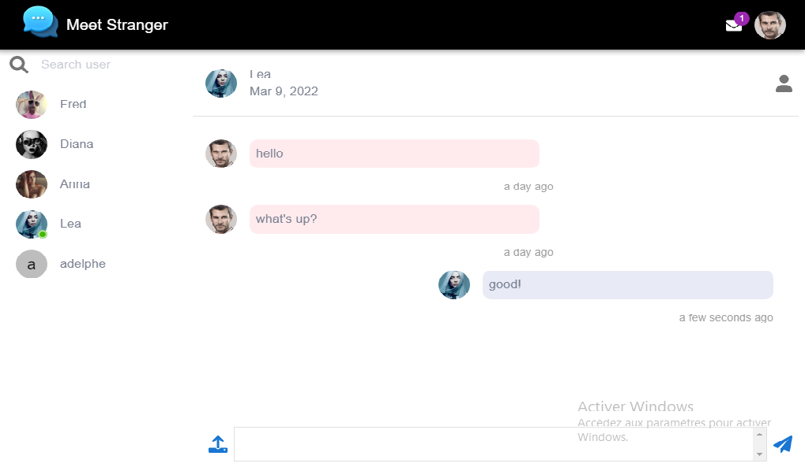

<p align="center">
  
  <a href="https://adelphe-chat-app.herokuapp.com/conversation">Demo</a>
  
</p>

>
> This application is real time chat app with react, material ui,socket.io,mongoDb and nodejs.
>
---

## Features
 
-With Babel and webpack configuration 
-2 factors authentication for registration
-protection against csrf attack
-real time notification and message with socket io

## Upcoming Features

-video chat
-chat room
-user following and followers 
-enhance the user settings
-user post
-test unitaire
-end-to-end test

## Getting Started
> 🚩 **Note**
>
> You can login to the app with any of the [example app users](./backend/data.js). The default password for all users is `123`

### Installation
```shell
git clone https://github.com/adelpheRaime/meet-stanger.git
```
#### Backend
```shell
cd backend
npm install
```
#### Frontend
```shell
npm install 
```
### Running App for Back and Front
```shell
npm start
```
> 🚩 **Note**
>Make sure you connect to your mongodb cloud successfully

#### Insert dummy user into database
```shell
npm run seed:user
```

